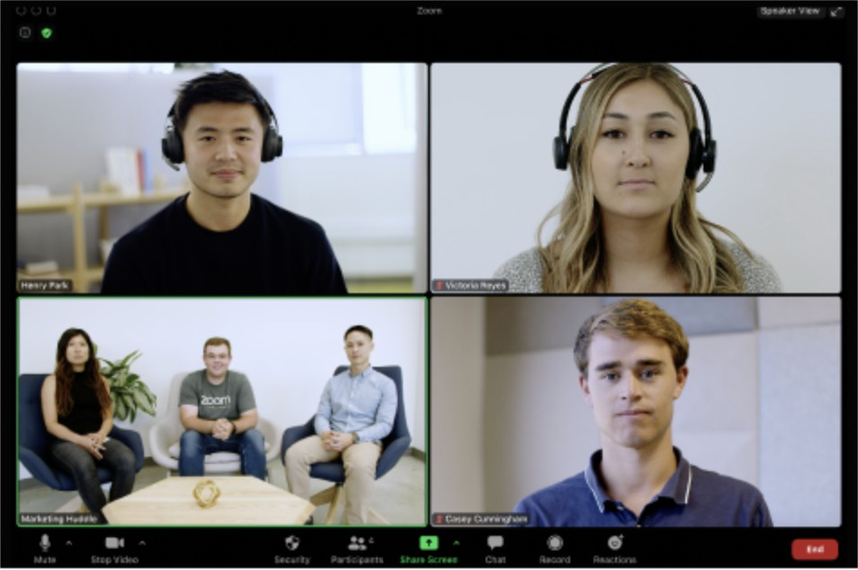
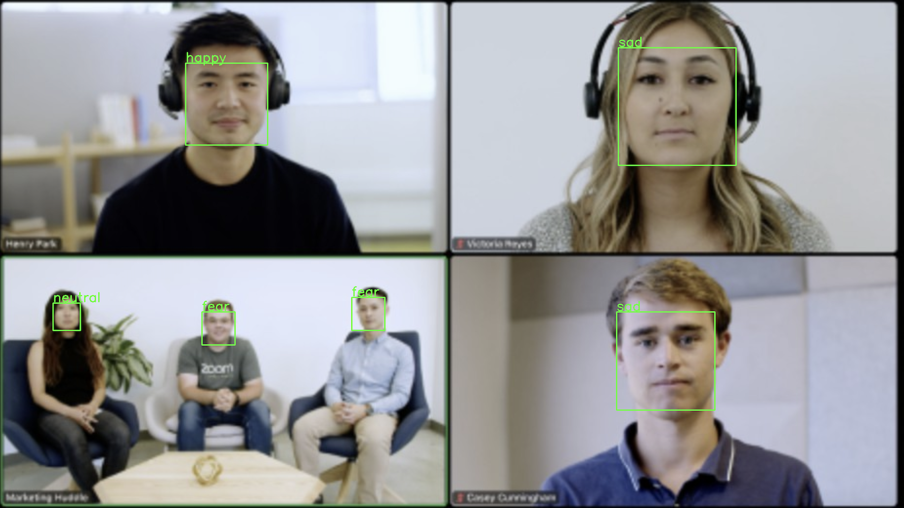
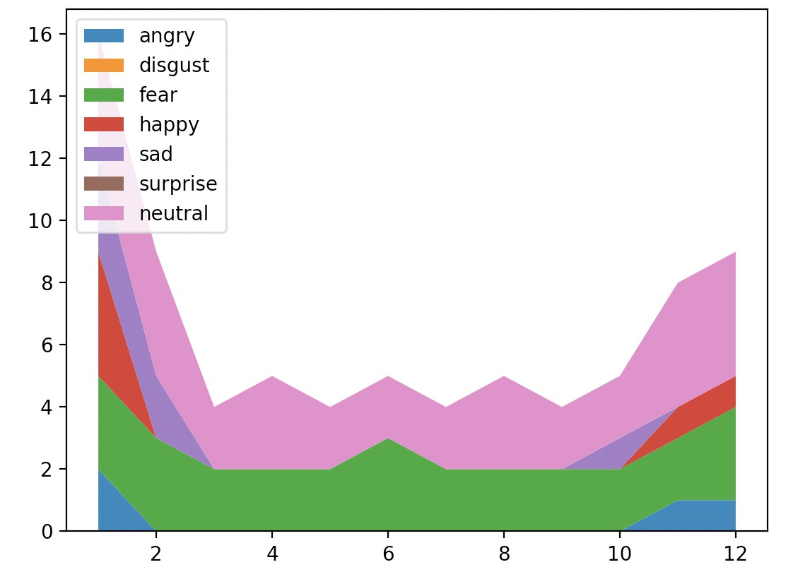

# face-emotion
Simple face emotion detecting for a meeting. It can do simple one face emotion detection, and multiple face detection, and can show the trend by capturing screen. 

## Run
```bash
pip install -r requirements.txt
python main.py
```

## Examples
### Input

### Output

### Live results


### Quick demo
https://user-images.githubusercontent.com/901975/104969981-5457cb00-5a2d-11eb-840f-c03a3ecd3599.mp4

## Welcome your contributions
Please send us PR!
